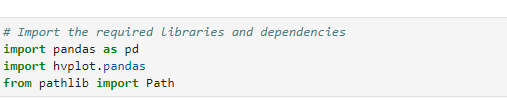
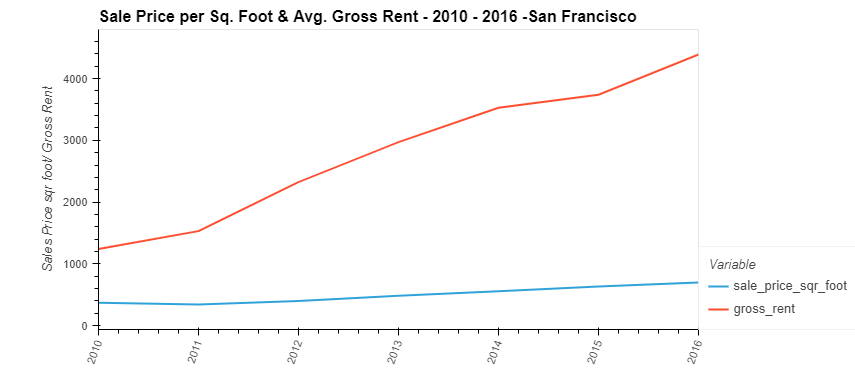

# Challenge_6_Housing_Rental_Market_Analysis_for_San_Francisco
This analysis is to determine if there are any potential investment opportunites in the San Francisco area for purchasing properties for rental income. 

---
## Technologies
The programming language used for this analysis was **Python (v 3.9.7)**.

The applicable libraries needed to run this analysis are:
>

---
## Installation Guide
All of the above libraries should be part of the base application that were installed with the Python version above; if not, you will have to install them through the pip package manager of Python.

---
## Contributor 

James Handral
james.handral@gmail.com

---
## License 

N/A

---
## Analysis Summary

1) The analysis starts with uploading the `sfo_neighorhoods_census_data.csv` into a Panda Data Frame for the analysis. The file contains housing units, gross rents and sale price per square footage from 2010 to 2016.

2) Per the analysis (link below) and the line plot for Sales Price per Sq Footage and Avg Gross Rent in San Francisco shows there are opportunities to purchase properties for Rental income based on the increasing rental prices and range bound sales prices for properties in the San Francisco area.

**link to Application**

[san_francisco_housing](./Starter_Code%20(7)/Starter_Code/san_francisco_housing.ipynb)

